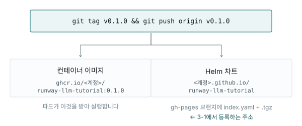

# 부록 A. 자가 빌드

본 흐름에서는 **이미 게시된 이미지와 차트**를 씁니다. 이 부록은 그것을 **직접 만들고
싶을 때** 보는 문서입니다.

읽어야 하는 경우는 셋입니다.

| 상황 | 볼 곳 |
|---|---|
| 코드를 고쳐서 내 버전을 쓰고 싶다 | A-1, A-2 |
| 폐쇄망이라 외부 주소(`ghcr.io`, `github.io`)에 못 나간다 | A-3, A-4 |
| 어떻게 게시되는지 궁금하다 | A-1 만 |

**본 흐름을 먼저 끝내고 보는 것을 권합니다.** 챗봇이 어떻게 생겼는지 알고 나면
여기 나오는 값들이 무엇인지 훨씬 잘 보입니다.

---

## A-1. 게시가 어떻게 되어 있나

저장소에 `.github/workflows/release.yaml` 이 들어 있습니다. 태그를 밀면 두 가지가
자동으로 게시됩니다.



3-1에서 등록한 리포지토리 URL이 아래쪽 주소입니다. 차트 안에는 위쪽 이미지 주소가
이미 박혀 있어서, 따라하는 사람은 아무것도 빌드하지 않습니다.

### 처음 한 번만 해 둘 것

| 무엇 | 어디서 |
|---|---|
| Actions에 쓰기 권한 | 저장소 Settings → Actions → General → Workflow permissions → **Read and write** |
| 저장소를 public으로 | private이면 이미지와 차트를 받는 데 인증이 필요합니다 |

첫 태그를 밀고 나면 Actions 탭에서 진행 상황을 볼 수 있고, 끝나면 두 주소가
살아 있습니다.

```bash
curl -s https://<계정>.github.io/runway-llm-tutorial/index.yaml | head -20
```

---

## A-2. 코드를 고쳐서 내 버전 쓰기

1. 코드를 고칩니다
2. **태그를 올려서** 밉니다

```bash
git add -A && git commit -m "프롬프트 수정"
git tag v0.1.1 && git push origin main --tags
```

3. Runway에서 애플리케이션 설정 → 차트 버전을 `0.1.1` 로 바꾸고 **다시 배포**

> ⚠ **같은 태그를 다시 쓰지 마세요.**
>
> 쿠버네티스는 이미 받아 둔 이미지를 다시 받지 않습니다. 같은 태그로 다시 올리면
> 레지스트리만 바뀌고 **실행되는 것은 옛 이미지 그대로**입니다. 게다가 파드
> 이벤트에는 "이미 있음"이라고 성공처럼 찍힙니다.
>
> 증상이 "고쳤는데 반영이 안 된다"로 나타나서, 원인을 코드에서 찾게 됩니다.

바꿔 볼 만한 것:

| 값 | 무엇이 바뀌나 |
|---|---|
| `runway.llm.systemPrompt` | 답변 말투와 규칙 (재배포만 하면 됨, 이미지 불필요) |
| `app/mcp_server/server.py` 의 docstring | AI가 도구를 언제 부를지 |
| `app/chatbot/ingest.py` 의 `CHUNK_CHARS` | 문서를 얼마나 잘게 쪼갤지 |

---

## A-3. 폐쇄망 — 사내 Gitea에 올리기

클러스터가 외부 인터넷에 못 나가면 `ghcr.io` 와 `github.io` 를 쓸 수 없습니다.
사내 Gitea에 직접 올려야 합니다.

> **본 흐름의 [3-1](../03-chatbot/01-deploy.md)이 이 경로를 이미 다룹니다** —
> 코드를 받아 Gitea에 올리고, Gitea Actions로 이미지를 빌드하고, 차트를 올려
> 등록 주소를 얻는 데까지. 도커가 있는 컴퓨터에서 직접 빌드하고 싶거나, 그때
> 무엇이 오가는지 더 알고 싶을 때 이 절을 보세요.

### Gitea에 먼저 로그인

프로젝트 Gitea 조직은 비공개이고, **조직 멤버십은 SSO로 로그인하는 순간에**
만들어집니다. 한 번도 로그인한 적이 없으면 조직이 아예 안 보이고 404가 뜹니다.

콘솔 → **Built-in Apps** → **Gitea** 카드로 들어가세요. 그 경로가 SSO를 탑니다.

> 조직이나 저장소가 404로 보이면 가장 먼저 의심할 것이 이것입니다. 권한 문제처럼
> 보이지만 대개는 그냥 로그인을 안 한 것입니다.

### 토큰 발급

Gitea → 프로필 → **Settings** → **Applications** → **Generate Token**.

| 스코프 | 무엇에 필요한가 |
|---|---|
| `write:repository` | 소스 push |
| `write:package` | **이미지와 차트 push** |

> 이미지와 차트는 저장소가 아니라 **패키지 레지스트리**에 올라갑니다.
> `write:repository` 만 있는 토큰으로는 실패하고, 오류 메시지가 `authGroup.Verify`
> 처럼 불친절해서 원인을 알기 어렵습니다.

토큰은 한 번만 표시됩니다. 그리고 **URL에 넣지 마세요** — 셸 기록과 `.git/config`
에 남고, Code Server의 홈은 재시작해도 남습니다.

```bash
read -s GITEA_PAT && export GITEA_PAT
```

### 이미지 빌드

Code Server에는 도커 데몬이 없어서 거기서는 빌드할 수 없습니다.
도커가 있는 컴퓨터에서:

```bash
docker login gitea.<도메인>
docker build -t gitea.<도메인>/<프로젝트 ID>/llm-tutorial:0.1.0 app/
docker push gitea.<도메인>/<프로젝트 ID>/llm-tutorial:0.1.0
```

> ⚠ **이미지는 반드시 프로젝트 조직 밑에 올리세요.**
>
> 프로젝트의 이미지 받아오기 자격증명은 **조직 봇 계정** 것이라 권한이 조직
> 범위에만 있습니다. 개인 계정(`gitea.<도메인>/<내계정>/...`) 밑에 올리면 봇이
> 읽지 못해 파드가 `ImagePullBackOff` 로 멈춥니다.

도커가 있는 컴퓨터가 없다면 **Gitea Actions**를 쓸 수 있습니다. 플랫폼에 도커가
붙은 러너가 깔려 있습니다. 다만 러너가 실제로 도는지 먼저 확인하세요 — 미러가
설정되지 않은 설치본에서는 작업이 큐에서 움직이지 않습니다.

### 임베딩을 어디서 계산할지

이 결정은 **이미지를 만드는 시점**에 해야 합니다.

게이트웨이에 임베딩 모델이 있는지 먼저 봅니다.

```bash
curl -s -H "Authorization: Bearer sk-여기에LLM키" https://llm.<도메인>/v1/models
```

| 목록에 `bge`·`embedding`·`e5` 같은 이름이 | 할 일 |
|---|---|
| **있다** | 그대로 두세요. 기본 이미지가 게이트웨이를 씁니다 |
| **없다** | `app/Dockerfile` 에서 로컬 임베딩 두 줄의 주석을 풀고 빌드 |

로컬 임베딩을 켜면 이미지가 1.5 GB 넘게 커지고 첫 실행에서 모델을 내려받습니다.
대신 게이트웨이 구성과 무관하게 동작합니다.

### 차트 패키징과 업로드

차트가 방금 올린 이미지를 가리키도록 고칩니다.

```yaml
# chart/values.yaml
image:
  repository: "gitea.<도메인>/<프로젝트 ID>/llm-tutorial"
  tag: "0.1.0"

imagePullSecrets:
  - name: gitea-image-pull-secret-runway-bot-token
```

그다음 저장소의 스크립트를 씁니다.

```bash
GITEA_HOST=gitea.<도메인> GITEA_USER=<계정> GITEA_OWNER=<프로젝트 ID> \
  scripts/package-chart.sh
```

helm이 없어도 됩니다 — 스크립트가 직접 묶는 경로를 갖고 있습니다.

### 확인 — 이게 되면 등록도 됩니다

```bash
curl -s --user <계정>:$GITEA_PAT \
  "https://gitea.<도메인>/api/packages/<owner>/helm/index.yaml"
```

`entries:` 아래에 `llm-tutorial` 과 버전이 보이면 정상입니다.

### 3-1에서 등록할 주소

| 용도 | 주소 |
|---|---|
| **등록** (폼에 넣을 값) | `https://gitea.<도메인>/api/packages/<owner>/helm` |
| 업로드 | 위 + `/api/charts` |
| 사람이 보는 페이지 | `https://gitea.<도메인>/<owner>/-/packages` |

> **등록 주소를 브라우저로 열면 404가 나는 것이 정상입니다.** 웹 페이지 주소를
> 등록하면 HTML이 돌아와 실패합니다. `.git` 이나 `/index.yaml` 을 붙이지도 마세요.

> **주소를 확정한 뒤에 한 번에 등록하세요.** 콘솔에는 리포지토리 삭제 화면이 없고,
> 같은 주소를 다시 등록하면 `REPOSITORY_EXISTS` 로 막힙니다.

---

## A-4. 등록이 `CONNECTION_FAILED` 로 실패하면

이건 자격증명 문제가 **아닙니다.** 클러스터 안의 Argo CD가 그 주소에 닿지 못한
것입니다. 내 컴퓨터에서 `curl` 이 된다고 해서 되는 것이 아닙니다 — 인증서 신뢰
설정이 서로 다릅니다.

Argo CD에서 직접 등록할 수 있고, **그렇게 등록한 리포지토리는 Runway 생성 폼의
목록에 그대로 나타납니다.**

`https://argocd.<도메인>` → Settings → Repositories → CONNECT REPO

| 칸 | 값 |
|---|---|
| Connection method | VIA HTTPS |
| **Type** | **helm** ← 기본값이 `git` 이므로 반드시 변경 |
| Name | `llm-tutorial` |
| **Project** | Runway 프로젝트 ID |
| Repository URL | 위의 등록 주소 |
| Username / Password | 계정명 / 토큰 |
| Skip server verification | TLS 문제 진단 시 체크 |

이 화면은 Runway 콘솔이 뭉뚱그린 원인을 **문자열 그대로** 보여 줍니다.

- `x509: certificate signed by unknown authority` → TLS 신뢰 문제
- `dial tcp: lookup ... no such host` → DNS
- 타임아웃 → 외부 접속 차단

---

## A-5. Container Box — 차트 없이 배포하기

차트를 만들기가 부담스럽다면, 이미지만 있으면 되는 방법도 있습니다.
Runway 기본 템플릿 **Container Box** 는 "아무 컨테이너 이미지나 실행"하는 용도입니다.

| 그룹 | 칸 | 값 |
|---|---|---|
| 이미지 | repository / tag | 올린 이미지 주소와 태그 |
| 접근 | ports | 이름 `http`, 컨테이너 포트 `8000` |
| 시크릿 | OpenBao 엔진 / 이름 | `tutorial` / `llmchat` |
| 스토리지 | existingClaim | `llm-tutorial-data` |
| 고급 | service port / targetPort | `80` / `8000` |
| 고급 | env | `LLM_BASE_URL`, `QDRANT_URL`, `QDRANT_COLLECTION` |
| 고급 | imagePullSecrets | `gitea-image-pull-secret-runway-bot-token` |

차트 쪽이 나은 점은 **값이 틀렸을 때 배포 전에 거부해 준다**는 것입니다 —
호스트명 대소문자, 포트 불일치, 설정 조합 오류까지. Container Box는 그 검사를
해 주지 않아서, 틀리면 배포된 뒤에 알게 됩니다.

---

← [5-1. 팀에 공개하기](../05-share/01-publish.md) | 다음: [부록 B. 코드 살펴보기 →](b-code-tour.md)
