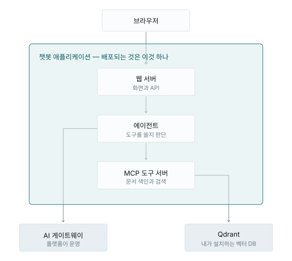

# 무엇을 만드나요?

**내 문서를 읽고 답하는 AI 챗봇**을 Runway 위에 만들어 배포합니다.

개발 지식이 없어도 됩니다. 대부분 화면에서 클릭하고 값을 붙여 넣는 작업이고,
명령어가 필요한 곳은 그대로 복사해 쓸 수 있게 적어 두었습니다.

---

## 완성하면 이런 것을 씁니다

사내 규정 문서를 올려 두고 이렇게 물어봅니다.

```
연차가 며칠이라고 되어 있어?
```

챗봇은 이 질문에 답하려면 **저장된 문서를 봐야 한다고 스스로 판단**하고, 문서 창고를
뒤져서, 찾은 내용을 근거로 답합니다.

```
▸ 도구 호출: search_documents
▸ 도구 결과: [1] policy.md › 휴가 규정 …

문서에 따르면 연차는 15일입니다. 반차는 하루 두 번까지 쓸 수 있습니다.
```

우리가 "검색해"라고 시킨 것이 아닙니다. 스스로 판단한 것입니다. 이것이 **에이전트**와
그냥 챗봇의 차이입니다.

반대로 "1 더하기 1은?" 같은 질문에는 문서를 뒤지지 않습니다. 그 구분도 스스로 합니다.

---

## 구조



키는 OpenBao에서 실행 시점에 전달됩니다 — 설정 어디에도 값이 남지 않습니다.

만드는 것은 애플리케이션 **세 개**입니다.

| 무엇 | 하는 일 | 언제 |
|---|---|---|
| Code Server | 브라우저에서 열리는 작업 화면. 확인 작업에 씁니다 | 1단계 |
| Qdrant | 문서 창고 | 2단계 |
| 챗봇 | 대화 + 문서 검색 | 3단계 |

**Code Server** — 브라우저에서 그대로 열리는 코드 편집기입니다. 내 컴퓨터에는
아무것도 설치하지 않고, 주소를 열면 편집기와 터미널이 화면에 뜹니다. 이 튜토리얼
에서는 코드를 짜는 데 쓰지 않고 **눈으로 확인하는 데만** 씁니다 — OpenBao에 저장한
키가 실제로 챗봇 쪽에 도착하는지(1-3), 문서 창고에 연결이 되는지(2-2). 챗봇을
만드는 데 반드시 필요한 것은 아니지만, 여기서 확인해 두면 나중에 챗봇이 안 될 때
어디를 봐야 할지 이미 알고 시작하게 됩니다.

**Qdrant** — 벡터 데이터베이스입니다. 보통의 데이터베이스가 "이 단어가 들어간 줄"을
찾아 준다면, 벡터 DB는 **뜻이 가까운 문단**을 찾아 줍니다. 그래서 "연차가 며칠이야?"
라고 물었을 때 문서에 '연차'라는 말이 없고 '유급휴가'라고 적혀 있어도 찾아냅니다.
올린 문서는 문단 단위로 잘려서 여기에 저장되고, 챗봇은 질문을 받을 때마다 여기서
관련 대목만 꺼내 씁니다.

**챗봇** — 우리가 배포하는 앱입니다. 화면, 대화, 문서 올리기, 그리고 "지금 문서를
찾아봐야 하나"라는 판단까지 전부 이 안에 들어 있습니다. 앞의 둘은 Runway가 제공하는
목록에서 고르기만 하면 되지만, 이것은 그 목록에 없습니다 — 그래서 3단계에서 **차트
주소를 등록해서** 설치합니다.

여기에 **MCP 도구 서버**가 챗봇 안에서 함께 돕니다. 따로 설치하지 않습니다 —
챗봇을 배포하면 같이 딸려 옵니다.

---

## 전체 순서

```
0단계  사전 준비        키를 만들고 OpenBao에 저장합니다
1단계  개발 환경        저장 공간과 작업 화면을 만듭니다
2단계  문서 창고        Qdrant를 설치합니다
3단계  챗봇 배포        차트를 등록하고 배포합니다
4단계  사용하기         문서를 올리고 대화합니다
5단계  팀에 공개        주소를 열고 비밀번호를 겁니다
```

전부 합쳐 **약 1시간 30분**입니다. 중간에 끊고 나중에 이어서 해도 됩니다 —
만들어 둔 것은 그대로 남습니다.

---

## 필요한 것

| | |
|---|---|
| Runway 프로젝트 계정 | 프로젝트에 참여(member 이상)되어 있어야 합니다 |
| 브라우저 | 대부분의 작업이 여기서 일어납니다 |

**설치할 것은 없습니다.** 컨테이너 이미지와 Helm 차트는 이미 만들어져 게시되어
있고, 우리는 그 주소를 입력하기만 합니다.

> 직접 만들어 보고 싶거나, 인터넷이 막힌 폐쇄망이라 외부 주소를 쓸 수 없다면
> [부록 A. 자가 빌드](../appendix/a-self-build.md)에 방법이 있습니다. 본 흐름을
> 먼저 끝내고 보는 편을 권합니다.

---

다음: [애플리케이션 알고가기 →](02-runway.md)
